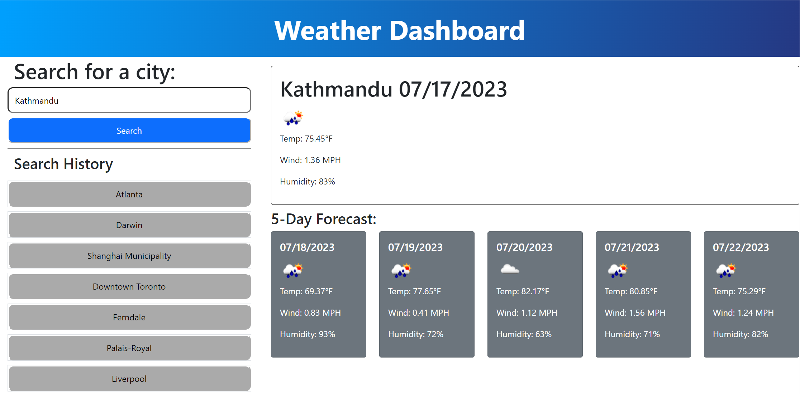

# Weather-Dashboard

## Description
- What was your motivation?
My motivation for this project was to build a simple weather dashboard where a user could search for a place and recieve weather data for the current day and the following five days.

- Why did you build this project? 
^

- What problem does it solve?
^

- What did you learn?
I learnt about effectively utilising bootstrap and practiced using the fetch method.

## Installation

Navigate to github repo at https://github.com/J-D-garwood/Weather-Dashboard. Download all files (index.html, assets folder w/ css and js)

## Credits

No collaborators on this project

## License

N/a

## link to deploayed application
https://j-d-garwood.github.io/Weather-Dashboard/

## Image of deployed application

